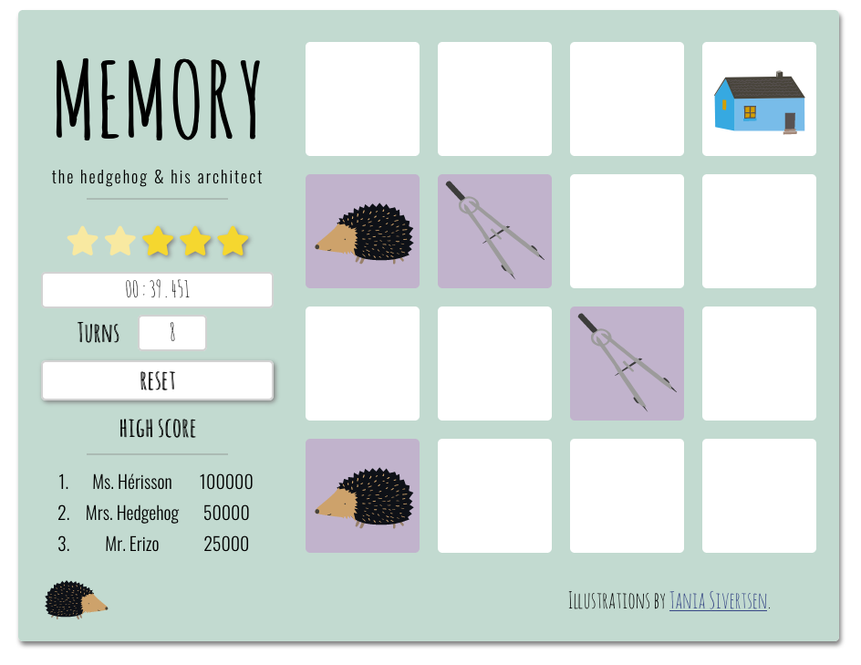

# Memory
A memory game.

Build as the second project to the Udacity Front End Nano-Degree.

## Dependencies
* jQuery
* FontAwesome
* GoogleFonts

## How to play
+ Turn around the cards.
+ Find all matching images.
+ Win.

If you make it in the top 3 you can put your name in the high score.

You can play it on a desktop computer or on your mobil device.

## How I build it
Slowly and carefully and from scratch.

For the cards I used the illustrations from my childens book *the hedgehog & his architect* drawn by [Tania Sivertsen](https://taniasivertsen.jimdo.com/).

The game keeps track of the time, the turns and a star rating. Depending on your (lack of) progress you lose stars. In the end the star rating and the time are used to calculate your score.
If you can beat the members of the Hegehog Family you can enter your name to the top 3. (The score is not saved anywhere and will be lost when the browser is closed or the site refreshed.)

**I hope you have as much fun playing it as I had fun building it!**
